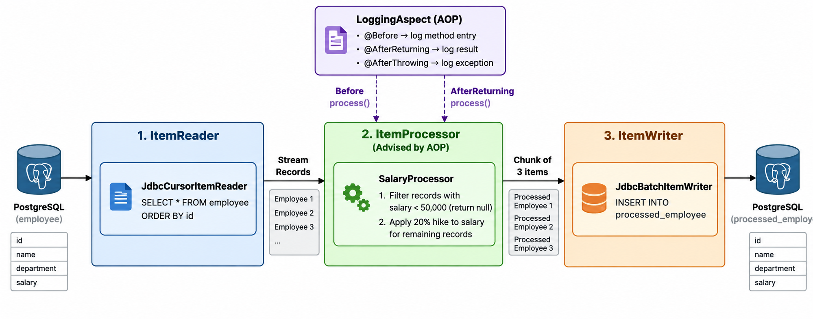

# Batch One — Employee Salary Batch Processing Pipeline

[](https://www.oracle.com/java/)
[](https://spring.io/projects/spring-boot)
[](https://spring.io/projects/spring-batch)
[](https://www.postgresql.org/)
[](https://opensource.org/licenses/MIT)

A production-grade, chunk-oriented ETL pipeline built using **Spring Batch** and **Spring Boot**. The service reads employee records from a relational database, applies business filtering and salary adjustment transformations, logs lifecycle metrics via **Spring AOP (AspectJ)**, and persists processed records to an audit-ready target table in PostgreSQL.

---

## Architecture & Data Flow

The batch job `salaryJob` executes a single chunk-oriented step (`salaryStep`) configured with a chunk commit interval of **3 items**:



### Chunk Processing Cycle
1. **Reader (`JdbcCursorItemReader`)**: Streams unindexed/indexed employee records cursor-by-cursor using `EmployeeRowMapper`.
2. **Processor (`SalaryProcessor`)**:
   - **Filter condition**: Any employee with salary `< 50,000` is discarded (returns `null`).
   - **Transformation**: Qualified employees receive a 20% salary increase (`salary * 1.2`).
3. **Observability (`LoggingAspect`)**: Wraps method execution via AspectJ auto-proxying, logging input payloads, execution timings, and output objects.
4. **Writer (`JdbcBatchItemWriter`)**: Performs batch-mapped prepared statement execution inserting into `processed_employee`.
5. **Transaction**: Commits transaction every 3 items via `PlatformTransactionManager`.

---

## Tech Stack

| Technology | Purpose |
|------------|---------|
| **Java 21** | Modern LTS runtime platform |
| **Spring Boot 4.x** | Core application scaffolding & auto-configuration |
| **Spring Batch 5.x** | Chunk-based job/step framework with job repository tracking |
| **Spring Data JDBC** | Data source abstraction & database initialization |
| **Spring AOP & AspectJ Weaver** | Cross-cutting logging and method execution tracing |
| **PostgreSQL** | Relational data persistence engine |
| **Lombok** | Boilerplate reduction for data models & loggers |

---

## Project Structure

```
batch-one/
├── .env.example                                      # Sample environment template
├── .gitignore                                        # VCS ignore patterns
├── pom.xml                                           # Maven dependencies & build configuration
├── src/
│   ├── main/
│   │   ├── java/learn/spring/springbatch/batch/one/
│   │   │   ├── BatchOneApplication.java              # Application main entry point
│   │   │   ├── aspect/
│   │   │   │   └── LoggingAspect.java                # AspectJ pointcut & advice configuration
│   │   │   ├── config/
│   │   │   │   └── BatchConfig.java                  # Job, Step, Reader, and Writer beans
│   │   │   ├── model/
│   │   │   │   └── Employee.java                     # Employee domain entity
│   │   │   ├── processor/
│   │   │   │   └── SalaryProcessor.java              # Transformation & filtering logic
│   │   │   └── reader/
│   │   │       └── EmployeeRowMapper.java            # JDBC ResultSet to Employee mapper
│   │   └── resources/
│   │       ├── application.yaml                      # Base application configuration
│   │       ├── application-dev.yaml                  # Development profile overrides & logging
│   │       ├── flowchart.png                         # Batch architecture & data flow diagram
│   │       └── schema.sql                            # Source & destination DDL + seed data
│   └── test/
│       └── java/learn/spring/springbatch/batch/one/
│           └── BatchOneApplicationTests.java         # Spring Boot context sanity test
```

---

## Database Schema

The application automatically executes `schema.sql` on startup (configured via `spring.sql.init.mode=always` and `spring.batch.jdbc.initialize-schema=always`).

### 1. Source Table: `employee`
```sql
CREATE TABLE employee (
    id BIGSERIAL PRIMARY KEY,
    name VARCHAR(100),
    department VARCHAR(50),
    salary DECIMAL(10,2)
);
```

### 2. Destination Table: `processed_employee`
```sql
CREATE TABLE processed_employee (
    id BIGINT PRIMARY KEY,
    name VARCHAR(100),
    department VARCHAR(50),
    salary DECIMAL(10,2),
    processed_at TIMESTAMP DEFAULT CURRENT_TIMESTAMP
);
```

---

## Environment Setup & Configuration

### Prerequisites
- **JDK 21** or later installed
- **PostgreSQL** (running locally or via Docker)

### 1. Setup Environment Variables
Copy the `.env.example` file and adjust with your database credentials:

```bash
cp .env.example .env
```

Contents of `.env`:
```env
DB_URL=jdbc:postgresql://localhost:5432/batchdb
DB_USERNAME=postgres
DB_PASSWORD=postgres
```

### 2. Prepare PostgreSQL Database
Ensure the PostgreSQL database exists:
```bash
# Using PostgreSQL CLI
createdb -U postgres batchdb

# Or with Docker
docker run --name batch-postgres -e POSTGRES_DB=batchdb -e POSTGRES_PASSWORD=postgres -p 5432:5432 -d postgres:16-alpine
```

---

## Running the Application

### Using Maven Wrapper
Run the Spring Boot application using the provided Maven wrapper:

```bash
# Development profile (default)
./mvnw spring-boot:run

# Or specifying explicit environment variables
DB_URL=jdbc:postgresql://localhost:5432/batchdb ./mvnw spring-boot:run
```

### Build & Package
```bash
./mvnw clean package
java -jar target/batch-one-0.0.1.jar
```

---

## Aspect-Oriented Monitoring (AOP)

The service includes `LoggingAspect` targeting `ItemProcessor.process(..)` executions:
- **`@Before`**: Captures class name and method before execution starts.
- **`@AfterReturning`**: Logs successful transformation payloads and returns.
- **`@AfterThrowing`**: Captures and logs any unhandled exceptions during processing.

### Sample Console Output
```text
INFO  [learn.spring.springbatch.batch.one.aspect.LoggingAspect] : ========== START ==========
INFO  [learn.spring.springbatch.batch.one.aspect.LoggingAspect] : Class  : SalaryProcessor
INFO  [learn.spring.springbatch.batch.one.aspect.LoggingAspect] : Method : process
INFO  [learn.spring.springbatch.batch.one.aspect.LoggingAspect] : Method process completed successfully
INFO  [learn.spring.springbatch.batch.one.aspect.LoggingAspect] : Returned Object : Employee(id=2, name=Rahul, department=Engineering, salary=72000.0)
INFO  [learn.spring.springbatch.batch.one.aspect.LoggingAspect] : ========== END ==========
```

---

## Commit & Branching Guidelines

This project adheres to the **Conventional Commits** specification. Refer to `COMMIT_CONVENTION.md` in the root repository for commit scopes, types, and branching strategies (`main` vs `dev`).
