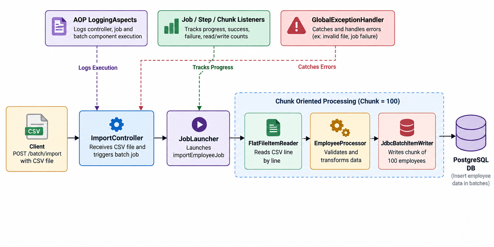

# Batch2CSV — Dynamic CSV Upload & Batch Processing Pipeline

[](https://www.oracle.com/java/)
[](https://spring.io/projects/spring-boot)
[](https://spring.io/projects/spring-batch)
[](https://www.postgresql.org/)

A production-grade, API-driven ETL pipeline built using **Spring Batch** and **Spring Boot**. The service exposes a REST endpoint to dynamically upload CSV files, streams the records in chunks, applies business transformations, tracks execution comprehensively through Job, Step, and Chunk listeners, and persists processed records to a target table in PostgreSQL.

---

## Architecture & Data Flow

The batch job `importEmployeeJob` is triggered dynamically via a REST Controller. It executes a single chunk-oriented step (`step`) configured with a chunk commit interval of **100 items**:



### Chunk Processing Cycle
1. **REST Controller (`ImportController`)**: Exposes a `POST /batch/import` multipart-file endpoint. 
2. **Reader (`FlatFileItemReader`)**: Streams the dynamically uploaded CSV file line-by-line via a `@StepScope` injected path, mapping CSV columns to the `Employee` object.
3. **Processor (`EmployeeProcessor`)**: 
   - **Transformation**: Applies business logic (e.g., standardizing text, adjusting data) on each record.
4. **Listeners & Observability**: 
   - Uses `JobListener`, `StepListener`, and `ChunkListener` for fine-grained batch execution metrics.
   - Wraps controller and service executions via AOP (`ControllerLoggingAspect`, `ServiceLoggingAspect`).
5. **Writer (`JdbcBatchItemWriter`)**: Performs high-performance batch prepared statement inserts into the `employee` table.
6. **Exception Handling**: Centrally managed by `GlobalExceptionHandler` with standard `ApiResponse` mapping.

---

## Tech Stack

| Technology | Purpose |
|------------|---------|
| **Java 21** | Modern LTS runtime platform |
| **Spring Boot 4.x** | Core application scaffolding & auto-configuration |
| **Spring Batch 6.x** | Chunk-based job/step framework with job repository tracking |
| **Spring Web** | REST API layer for dynamic job triggering |
| **Spring Data JDBC** | Data source abstraction & database initialization |
| **Spring AOP & AspectJ Weaver** | Cross-cutting logging and method execution tracing |
| **PostgreSQL** | Relational data persistence engine |
| **Lombok** | Boilerplate reduction for data models & loggers |

---

## Project Structure

```
batch2csv/
├── .env.example                                      # Sample environment template
├── pom.xml                                           # Maven dependencies & build configuration
├── src/
│   ├── main/
│   │   ├── java/learn/spring/springbatch/batch2csv/
│   │   │   ├── Batch2csvApplication.java             # Application main entry point
│   │   │   ├── aop/                                  # AspectJ pointcut & advice configuration
│   │   │   ├── config/                               # Job, Step, and Batch configurations
│   │   │   ├── controller/                           # REST Endpoints (ImportController)
│   │   │   ├── dto/                                  # Standardized API response wrappers
│   │   │   ├── exception/                            # Global exception handling
│   │   │   ├── listener/                             # Job, Step, and Chunk listeners
│   │   │   ├── model/                                # Domain entities
│   │   │   ├── processor/                            # Transformation logic
│   │   │   ├── reader/                               # Step-scoped CSV file reader
│   │   │   ├── service/                              # Job launcher service
│   │   │   └── writer/                               # JDBC batch writers
│   │   └── resources/
│   │       ├── application.properties                # Base application configuration
│   │       ├── schema.sql                            # Destination DDL
│   │       └── employees.csv                         # Sample dataset
```

---

## Database Schema

The application automatically executes `schema.sql` on startup.

### Destination Table: `employee`
```sql
DROP TABLE IF EXISTS employee;

CREATE TABLE employee (
    id SERIAL PRIMARY KEY,
    name VARCHAR(255),
    department VARCHAR(255),
    salary DOUBLE PRECISION
);
```

---

## Environment Setup & Configuration

### Prerequisites
- **JDK 21** or later installed
- **PostgreSQL** (running locally or via Docker)

### 1. Setup Environment Variables
Configure your application environment (or update `application.properties`) with your database credentials:

```properties
spring.datasource.url=jdbc:postgresql://localhost:5432/batchdb
spring.datasource.username=postgres
spring.datasource.password=postgres
```

### 2. Prepare PostgreSQL Database
Ensure the PostgreSQL database exists:
```bash
# Using PostgreSQL CLI
createdb -U postgres batchdb

# Or with Docker
docker run --name batch-postgres -e POSTGRES_DB=batchdb -e POSTGRES_PASSWORD=postgres -p 5432:5432 -d postgres:16-alpine
```

---

## Running the Application

### Using Maven Wrapper
Run the Spring Boot application using the provided Maven wrapper:

```bash
./mvnw spring-boot:run
```

### Build & Package
```bash
./mvnw clean package
java -jar target/batch2csv-0.0.1.jar
```

---

## API Usage

You can trigger the batch job dynamically via REST:

### POST `/batch/import`
Upload a CSV file to process and import its contents into the database.

**Request:**
```bash
curl -X POST http://localhost:8080/batch/import \
  -F "file=@src/main/resources/employees.csv"
```

**Response (Success):**
```json
{
  "success": true,
  "message": "Batch job completed successfully",
  "data": "COMPLETED",
  "timestamp": "2024-03-24T12:00:00.000"
}
```

---

## Commit & Branching Guidelines

This project adheres to the **Conventional Commits** specification. Refer to `COMMIT_CONVENTION.md` in the root repository for commit scopes, types, and branching strategies (`main` vs `dev`).
